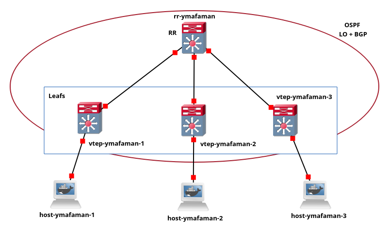
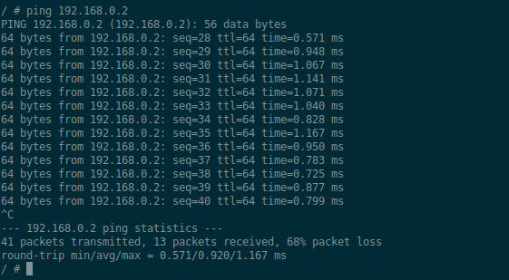
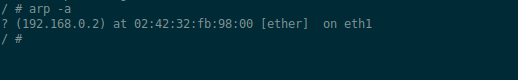
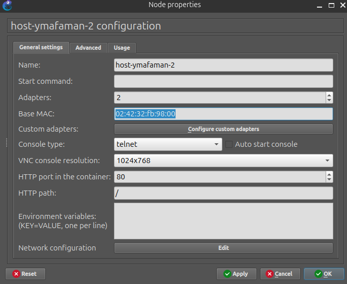

# P3 - BGP EVPN with VXLAN

The goal of this part is to allow hosts connected to different VTEPs to communicate through a VXLAN overlay.

EVPN is used as the learning strategy, so the VTEPs can dynamically learn and advertise MAC addresses using BGP EVPN.

## Topology



## How to Run

Build the Docker images:

```sh
make
```

Then open the GNS3 project:

```text
P3.gns3project
```

Start all nodes in GNS3.

## Test

Host 1 can reach Host 2 through the VXLAN EVPN overlay:

```sh
ping 192.168.0.2
```



After the ping, Host 1 learns the MAC address of Host 2:

```sh
arp -a
```



The learned MAC address matches the MAC address configured for Host 2 in GNS3:

